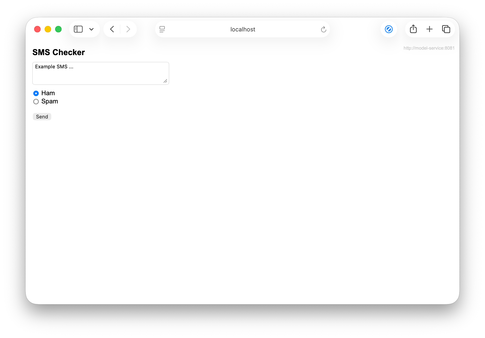
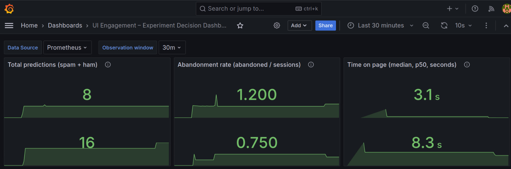

# Experiment: User Engagement Improvement

## Overview
This experiment will test if the new Experimental UI design improves user engagement compared to the existing Stable version.

## Deploying the Experiment
You can view both conditions of the experiment yourself. With the deployment of the app, two frontend versions are deployed:
1.  **Stable Version**: The current base version of the application.
2.  **Experimental Version**: The new version with the proposed UI changes.

To view the two versions, access the application (e.g., via `frontend.local` or your specific deployment URL). You may need to refresh or use specific headers/cookies to toggle between the stable and experimental versions depending on the routing configuration.

## Changes
The experiment compares two UI versions:

### Stable UI (Control)
The current interface uses a basic, functional design. It places elements linearly with minimal styling.

### Experimental UI (Variant)
The new interface implements a **Modern, Centered Card Layout**.
*   **Visual Hierarchy**: Enclosed in a shadowed card to focus attention.
*   **Typography**: Larger, more readable fonts.
*   **Call to Action**: Full-width, prominently colored button to encourage clicking.
*   **Input Area**: Larger, focused text area.

We hypothesize that this polished, professional look will increase user trust and make the interaction feel smoother, leading to higher usage.

## Hypothesis
The experimental UI will improve user engagement compared to the stable version. Specifically, we expect the better UX/UI to result in:
*   **Increasing Total Predictions by at least 15%**: Users are more likely to use a tool that looks professional and responsive.
*   **Decreasing Abandonment Rate by at least 15%**: Users are less likely to bounce immediately if the interface is visually appealing and easy to parse.
*   **Increasing Time on Page by at least 15%**: Users are more likely to spend time on the page if the interface is engaging and easy to use.

## Relevant Metrics
To analyze changes in user engagement, we will track:
*   **`total_predictions`**: The primary measure of engagement. We want to see more people actually using the tool.
*   **`abandonment_rate`**: The percentage of sessions where users leave without completing a prediction. A lower rate implies the UI is successfully retaining user attention.
*   **`time_on_page`**: While higher time *can* mean engagement, we are wary that it could also mean confusion. However, combined with higher interaction rates, it generally signals deeper engagement.

## Decision Process (Quantification)
We will deploy the Stable version to one user group and the Experimental version to another. We will collect metrics for `total_predictions`, `abandonment_rate` and `time_on_page` for both groups.

Using a Grafana dashboard, we will compare the performance over a significant time window.
*   **Success Criteria**: The Experimental UI must show a **>15% increase** in `total_predictions` AND a **>15% decrease** in `abandonment_rate` AND a **>15% increase** in `time_on_page` compared to the Stable baseline.

## Grafana Results
Below are the results of the experiment. The data shown below is based on mocked data (due to a lack of real users), so all derived conclusions are hypothetical.

Based on the results below:
- The total predictions increased by 100%;
- The abandonment rate decreased by 37.5%;
- The time on page increased by 167.7%;

Thus, we can conclude that the experiment is a success. All metrics have improved significantly beyond the defined 15% threshold. Experimental UI will be rolled out to higher percentage of users (maybe now 10%-25%) to further validate the results.

## Limitations
*   **Mocked Data**: As this is an initial experiment setup for demonstration purposes, the data shown in the metrics dashboard is generated in a test environment. It does not reflect organic real-world traffic.
*   **Sample Size**: The duration and user count for this initial test are small, so the results may not be statistically significant.
