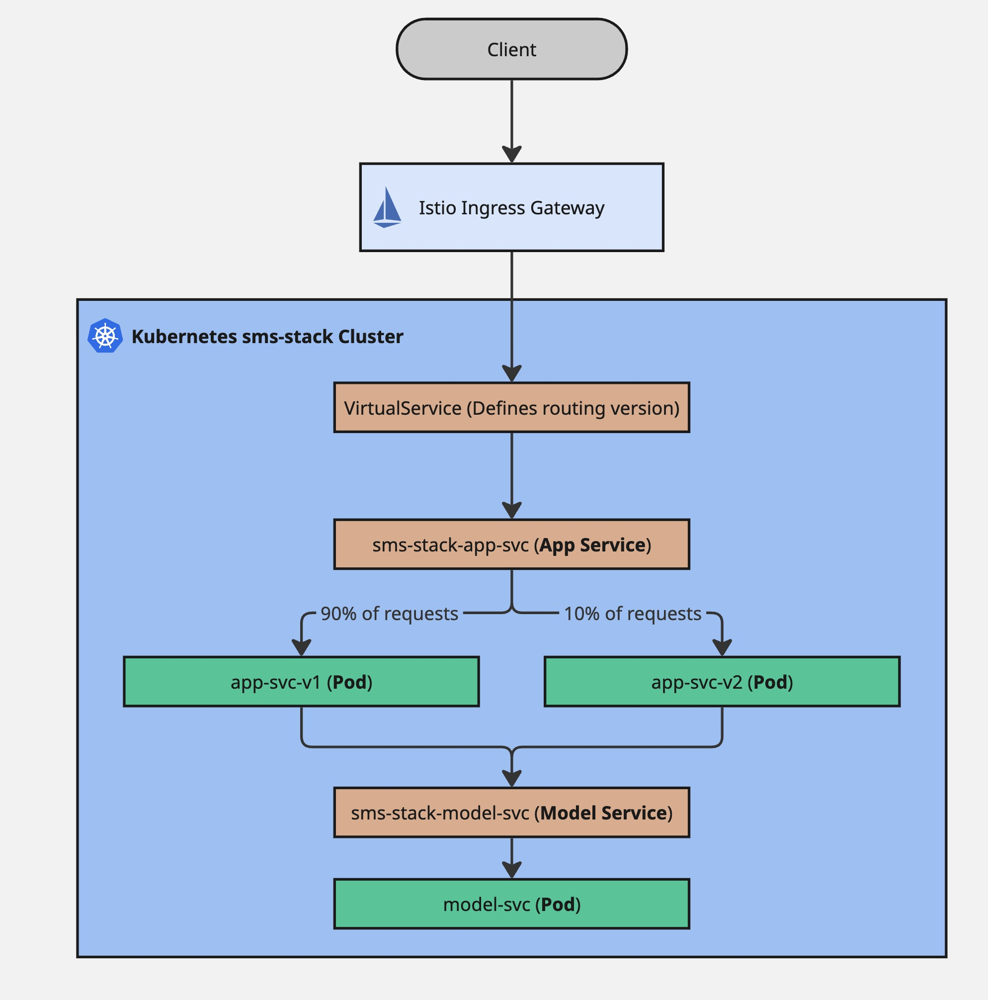
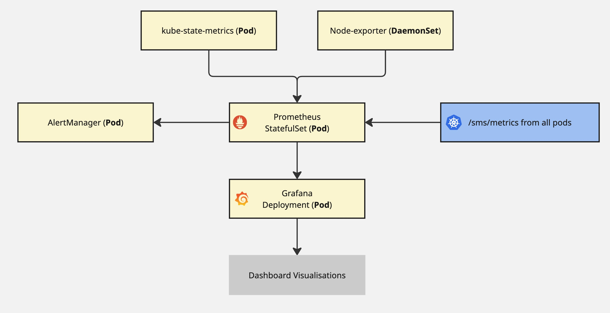
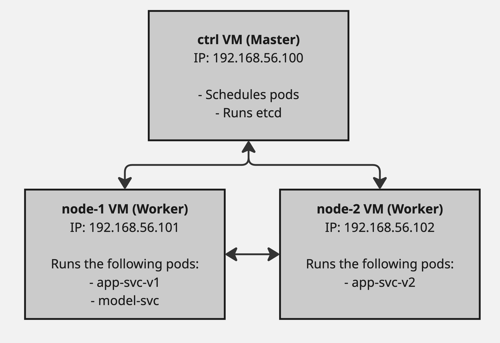

# Deployment Documentation
**Purpose:** This document provides a comprehensive overview of the SMS Checker deployment, enabling new team members to understand the system architecture and contribute to design discussions.

---

## Table of Contents

- [1. High-Level Overview](#1-high-level-overview)
- [2. Access & Connectivity](#2-access--connectivity)
- [3. Deployment Structure](#3-deployment-structure)
  - [Core Workloads](#core-workloads)
  - [Observability Stack](#observability-stack)
  - [Supporting Resources](#supporting-resources)
  - [Istio Traffic Management](#istio-traffic-management)
- [4. Request Flow & Traffic Management](#4-request-flow--traffic-management)
  - [Overview of the Additional Use Case](#overview-of-the-additional-use-case)
  - [Path of a Typical Request](#path-of-a-typical-request)
  - [Canary Release & Traffic Split](#canary-release--traffic-split)
- [Further Reading](#further-reading)

---

## 1. High-Level Overview

In this document, we outline the deployment structure of the SMS Checker application (`sms-stack`). The system is designed as a cloud-native application running on Kubernetes, utilising **Istio** for traffic management and **Helm** for centralised configuration of our two services: the **App Service** (frontend/API) and the **Model Service** (ML backend). Configuration is centralised using a single Helm chart.

In the latter stages of the assignments, the deployment focuses on observability and experimentation, featuring a monitoring stack and a canary release strategy managed via Istio VirtualServices.

## 2. Access & Connectivity

The application is exposed through an Istio Ingress Gateway. Below are the entry points for the system:

| Service                             | URL / Access Method                   | Description                                                   |
| :---------------------------------- | :------------------------------------ | :------------------------------------------------------------ |
| **Web Application (Stable)**  | `https://myapp.example.com`         | The main user interface for the SMS Checker.                  |
| **Web Application (Preview)** | `https://preview.myapp.example.com` | Direct access to the experimental version of the SMS Checker. |
| **Grafana Dashboard**         | `https://localhost:3000`            | Visualisation of app metrics and experiment data.             |
| **Prometheus**                | `https://localhost:9090`            | Metric collection and querying.                               |

> **Note:** Accessing `myapp.example.com` requires these entries to be present in the `/etc/hosts` file on your local machine, mapping them to the LoadBalancer IP of the cluster (e.g., `192.168.56.100`). For local testing, the main app service can simply be accessed at `https://localhost:8080`.

## 3. Deployment Structure

The application is deployed using a single, unified Helm chart (`myapp`) which manages all workloads, services, and the monitoring stack.

### **Core Workloads**

The system is composed of two primary microservices, communicating internally:

1. **App Service (`myapp-app-svc`):**

   * **Function:** Serves the frontend and acts as the API gateway.
   * **Replicas:** 2 replicas per version for high availability.
   * **Connectivity:** Communicates with the Model Service via its internal Kubernetes DNS name (`myapp-model-service`) on port 8081.
   * **Storage:** Mounts the shared volume (`/mnt/storage`) for shared data or configuration.
2. **Model Service (`myapp-model-service`):**

   * **Function:** Houses the ML model logic.
   * **Replicas:** 1 replicas per version.
   * **Exposure:** Accessed internally via a ClusterIP Service on target port 8081.

### **Observability Stack**

* **Prometheus:** Deployed internally, configured to scrape metrics from the App service.
  * **Scrape Configuration:** The `ServiceMonitor` targets the app pods on the path `/sms/metrics` every **5 seconds**.
* **Grafana:** Enables collected app and model metrics to be visualised with the provided dashboards.

### **Supporting Resources**

* **DestinationRules** (`myapp-app-dr`, `myapp-model-dr`): Define the v1/v2 subsets for traffic routing.
* **ConfigMaps**: Store environment variables and Grafana dashboard definitions.
* **Secrets**: Hold sensitive data such as SMTP credentials and TLS certificates.
* **PrometheusRule**: Defines alerting rules (e.g., `TooManyRequests`).
* **Alertmanager**: Handles alert routing and notifications.

### **Istio Traffic Management**

* **Gateway** (`gateway`): Accepts external traffic on port 80 and routes it into the mesh.
* **VirtualServices** (`myapp-istio-vs`, `myapp-model-vs`): Define routing rules including the 90/10 canary split and version consistency.
* **EnvoyFilters**: Extend gateway functionality with rate limiting capabilities.

## 4. Request Flow & Traffic Management

### Overview of the Additional Use Case

In addition to standard request routing and traffic splitting, we have chosen to implement rate limiting to protect backend services from overload and abuse. Rate limiting is implemented as a per-user rate request limit, applied to all incoming client traffic. In our implementation, users are identified using unique request headers, ensuring that we can isolate abusive users from the rest of the user-base.

#### Architecture

Rate limiting is enforced at the Istio Ingress Gateway using two mechanisms:

1. **Local Rate Limiting (Global):** A simple token-bucket rate limiter applied directly on the Envoy proxy. This provides a baseline protection against traffic spikes without external dependencies.

2. **External Rate Limit Service (Per-User):** For per-user limits, an external Rate Limit Service (RLS) backed by Redis tracks request counts per user. This allows individual users to be throttled independently based on the `x-user-id` header.

#### User Identification

Users are identified via a **self-declared header** (`x-user-id`). When making a request, clients include their identifier in the request header:

```
curl -H "x-user-id: name" http://myapp.example.com/sms/
```

The rate limiter uses this header value as the key for tracking request counts. Each unique `x-user-id` value maintains its own independent rate limit counter. 


| Component | Description |
| :--- | :--- |
| **EnvoyFilter (Local)** | Applies global rate limiting directly on the ingress gateway |
| **EnvoyFilter (RLS)** | Integrates the external RLS with the gateway |
| **Rate Limit Service** | Envoy-compatible gRPC service for distributed rate limiting |
| **Redis** | Backend storage for tracking per-user request counts |


#### Behaviour

- **Global limit (1000 req/min):** Applied to all traffic regardless of user identity.
- **Per-user limit (10 req/min):** Applied individually per `x-user-id` header value.
- **Response:** When rate limited, clients receive HTTP `429 Too Many Requests`.

### Path of a Typical Request

1. **Client Entry:** A user request is sent to `https://myapp.example.com`.
2. **Istio Gateway:** The request enters the Istio Ingress Gateway.
3. **Rate Limiting Enforcement:** At the Istio Ingress Gateway, and before any VirtualService routing is evaluated, the request is evaluated against the configured rate limiting rules. These rules define a maximum number of requests allowed within a fixed time window:
   - **Within Limit:** If the user's request limit has not been exceeded, the request proceeds through the normal VirtualService routing logic to the App Service.
   - **Limit Exceeded**: If the rate limit is exceeded, the request is rejected immediately, and the client receives an `HTTP 429 Too Many Requests` response.
4. **Ingress VirtualService Routing:** The gateway-facing VirtualService (`myapp-istio-vs`) intercepts the request.
5. **App Service Selection (Canary Logic):** The request is routed to either the V1 (stable) or V2 (preview) subset of the App Service Deployment based on weight. This random selection can be bypassed by using the `canary: experimental` header to select the preview version and `canary: stable` to select the stable version.
6. **Internal Model Service Call:** The App Service calls the Model Service (`myapp-model-service`).
7. **Model VirtualService Routing:** The `myapp-model-vs` VirtualService applies routing rules:
   - Requests with label `version: v2` are routed to the V2 subset (`preview`) of the Model Service, which has been modified to always predict spam for any given message.
   - All other requests are routed to the V1 subset (`stable`) of the Model Service, which runs the normal prediction pipeline.
8. **Response:** The Model Service returns the prediction to the App Service, which then returns the final response to the user.

This flow is illustrated in the figure below.



To monitor our application internally, we implement a monitoring stack with Prometheus and Grafana. While client requests travel through the Istio Ingress Gateway to the app-service and model-service pods, Prometheus continuously scrapes metrics from the app-service `/sms/metrics` endpoint, as well as from supporting sources like kube-state-metrics and node-exporter. Although the latter are not used in our dashboards, they can provide information on pod status and node-level metrics such as CPU usage. On the other hand, the app-service metrics are processed and visualised in Grafana, providing a real-time view of application latency as well as aggregated insights into the predictions made by the machine learning model. The Alertmanager listens for critical thresholds, providing notifications for incidents or unusual results.



Lastly, the figure below illustrates the physical deployment of our application, showing the Vagrant VMs that host the Kubernetes cluster, including the control plane and worker nodes, and how the pods and services may be distributed across them. Note that the distribution of services between the two workers may change, and Grafana, Prometheus, MetalLB, Istio, and Nginx pods have been omitted for brevity. Since all VMs share the same private subnet, they can easily communicate between each other.



| VM | Role | Key Components |
|:---|:-----|:---------------|
| **ctrl** | Control Plane | Kubernetes API, etcd, scheduler |
| **node-1** | Worker | App pods, Model pods, Prometheus |
| **node-2** | Worker | App pods, Grafana, Redis, RLS |

> **Note:** Pod distribution across workers is managed by the Kubernetes scheduler and may vary.

### Canary Release & Traffic Split

The **90/10 traffic split** is configured in `helm/myapp/values.yaml` under `istio.virtualService.weightStable` and `istio.virtualService.weightExperiment`. The routing decision is made by VirtualService `myapp-istio-vs` at the Istio Ingress Gateway.

* **Header bypass:** Adding `canary: enabled` header routes directly to v2 (preview).
* **Sticky sessions:** After a user's first visit, a `user_group` cookie is set (`v1` or `v2`) ensuring subsequent requests route to the same version for 24 hours.
* **Version consistency:** App v1 always calls Model v1, and App v2 always calls Model v2. This is enforced by `myapp-model-vs` which routes based on the calling pod's `version` label.

---

## Further Reading

* [Helm Chart Documentation](../helm/myapp/README.md)
* [Continuous Experimentation](./continuous-experimentation.md)
* [Extension Proposal](./extension.md)
